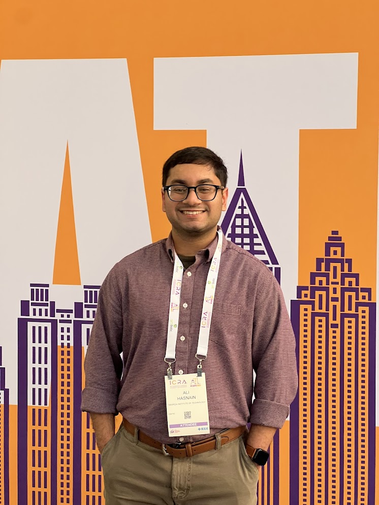

<table style="width:100%;border:0;" border="0">
  <tr>
    <!-- Left column: Bio -->
    <td style="vertical-align:middle;border:0;">
      

        I’m a junior at <strong>Georgia Tech (’27)</strong> 🐝 working on projects at the intersection of AI, robotics, and human-computer interaction.  
        My interests include autonomous systems, decision-making, computer vision + SLAM and perception, and building software that makes an impact.
        I'm also a founder of a <a href="https://hamsa.ngo" target="_blank" rel="noopener noreferrer">nonprofit</a>.
      

      

        <a href="mailto:shasnain9@gatech.edu">Feel free to contact me if you'd like to collaborate on research or nonprofit initiatives.</a>
      

    </td>

    <!-- Right column: Photo -->
    <td style="width:220px;text-align:right;border:0;">
      
    </td>
  </tr>
</table>

---

## Research

**JetAuto Autonomous Navigation at Clarkson University:**

As a Visiting Researcher at Clarkson University, I lead a project team of undergraduate and master’s students developing methods for autonomous navigation on a Jetson Nano robot.

Using **neural networks, ROS, and OpenCV**, we are building perception, control, and vision pipelines that enable the robot to navigate environments autonomously.  

I report directly to [**Chuck Thorpe**](https://www.clarkson.edu/people/chuck-thorpe), a pioneer in robotics, who serves as my mentor on this research.  

**Decision Processes Lab at Georgia Tech:**  

At Georgia Tech, I conduct research in the [**Decision Processes Lab**](https://dpl.gatech.edu/), reporting directly to [**Rick Thomas**](https://psychology.gatech.edu/people/rick-thomas), the lab PI. I contribute to the **HyGENE** model of hypothesis generation: turning cognitive theory into working code and experiments. My work includes implementing model components, running simulation/parameter sweeps, evaluating fit to human data, and building clean analysis/visualization pipelines to make the model easier to test and extend.

---

## Projects

- [**GT Movies Store**](gt-movies.md)  
  A Django 5 web application built as part of CS 2340 coursework, featuring a movie catalog with search, add/edit functionality, and user authentication.

